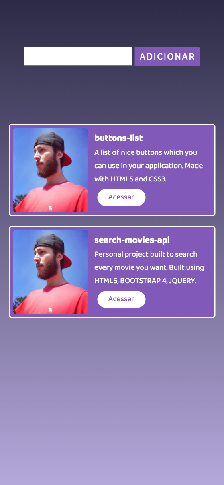

<h1 align="center">
    
</h1>
<h1 align="center">
    
</h1>

## 💻 About project

Personal project built to test some JavaScript abilities using webpack, axios and babel. This project uses Github API to find repositories, where you can enter an username/repository name, click on "Adicionar", and it will return the data of repository, containing:

-   User profile image
-   Repository name
-   Repository description
-   And a button containing a link which you can access the repository on Github

This project can be improved (it is already responsive), but I did it just to study webpack, so feel free to use this project.

## 🛠 Technology

#### **Website**

-   **[HTML5](https://developer.mozilla.org/pt-BR/docs/Web/HTML/HTML5)**
-   **[CSS3](https://www.w3schools.com/css/)**
-   **[JavaScript](https://developer.mozilla.org/pt-BR/docs/Web/JavaScript)**
-   **[Axios](https://www.npmjs.com/package/axios)**
-   **[Webpack](https://webpack.js.org/)**
-   **[Babel](https://babeljs.io/)**

#### **Utilitaries**

-   Editor: **[Visual Studio Code](https://code.visualstudio.com/)**
-   Fonts: **[Baloo Da 2](https://fonts.google.com/specimen/Baloo+Da+2)**

### Prerequisites

Before you begin, you will need to have the following tool installed on your machine:
[Git](https://git-scm.com)

In addition, it is good to have an editor to work with the code as **[VSCode](https://code.visualstudio.com/)**

### Running the web application (Front End)

```bash
# Clone this repository
$ git clone https://github.com/luizmr/repo-finder.git

# Access the project folder in the cmd/terminal
$ cd repo-finder

# Install al dependencies of app in cmd/terminal
$ npm install

# Run the application in terminal
$ npm run dev

# The application will be running at localhost:8080
```

## 📝 License

This project is under the MIT license.

Made with ❤️ by Luiz Marcelo Rocha
